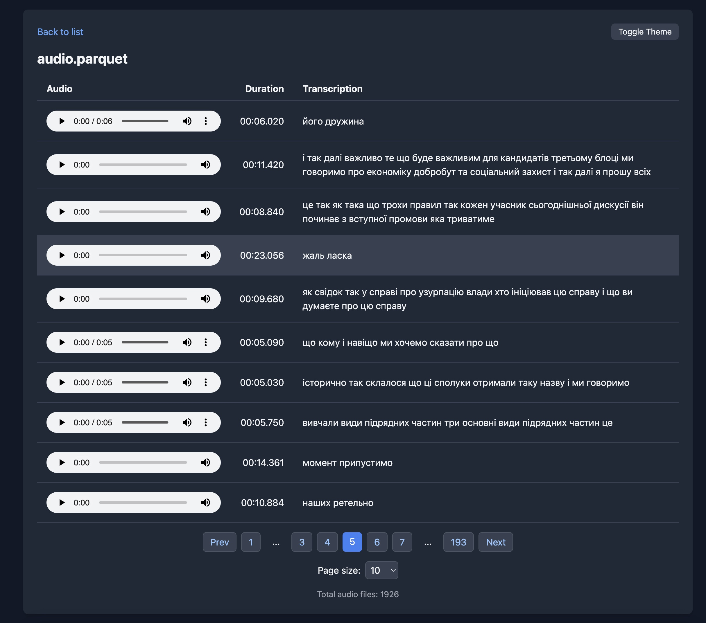

# Data Viewer for Audio

A lightweight, web-based viewer for exploring audio data embedded in Parquet files. Built with Rust, Axum, and Polars, this tool allows you to browse, search, and play audio clips directly in your browser. Perfect for data scientists, audio researchers, or anyone working with large-scale audio datasets in columnar formats.

Part of the [RustedBytes](https://github.com/RustedBytes) organization, focusing on high-performance data tools in Rust.

## Features

- **Parquet Integration**: Seamlessly read and query audio metadata from Parquet files using Polars.
- **Audio Playback**: Embedded HTML5 audio players for in-browser listening, with progress bars and duration display.
- **Pagination & Search**: Efficiently navigate large datasets with paginated results (configurable page size) and basic filtering.
- **Responsive UI**: Clean, dark-mode-friendly interface built with vanilla HTML/CSS/JS—no heavy frontend frameworks.
- **Concurrent Handling**: Leverages Tokio for scalable, async web serving to handle multiple requests efficiently.
- **Error-Resilient**: Robust error handling with `anyhow` for production-grade reliability.

## Screenshots



The interface displays audio entries with thumbnails, durations, and transcript snippets. Use the pagination controls to browse through results.

## Quick Start

### Prerequisites

- Rust 1.75+ (stable channel)
- A Parquet file containing audio data (e.g., columns for `audio` as bytes/binary, `duration` as f64, `transcript` as String).

### Installation

1. Clone the repository:
   ```bash
   git clone https://github.com/RustedBytes/data-viewer-audio.git
   cd data-viewer-audio
   ```

2. Build the project:
   ```bash
   cargo build --release
   ```

### Running the Server

The server will start at `http://localhost:3000`. Open it in your browser to start exploring your audio data.

### Usage

1. **Browse Data**: The root route (`/`) serves a paginated table of audio entries. Each row includes:
   - An audio player (play/pause, seek, volume).
   - Duration (e.g., "00:06.020").
   - Transcript snippet (truncated for preview).

2. **Navigation**:
   - Use "Prev/Next" buttons or page numbers for large datasets.
   - Adjust "Page size" dropdown (default: 10) for more/less results per page.

3. **Back to List**: From individual audio views, return to the full list.

Example CLI output on startup:
```
Server listening on http://0.0.0.0:3000
Loaded 1926 audio files from audio.parquet
```

## Dependencies

This project prioritizes the Rust standard library where possible, with minimal, battle-tested crates:

| Crate | Purpose | Version |
|-------|---------|---------|
| `axum` | Async web framework | 0.8.6 |
| `polars` | Parquet reading & querying | 0.51.0 (with `parquet`, `dtype-struct`) |
| `tokio` | Async runtime | 1.48.0 (full features) |
| `serde` | JSON serialization | 1.0.228 (derive) |
| `clap` | CLI argument parsing | 4.5.49 (derive) |
| `anyhow` | Error handling | 1.0.100 |
| `tokio-util` | Async utilities | 0.7.16 (full) |

See [Cargo.toml](Cargo.toml) for full details.

## Development

- **Testing**: Run unit tests with `cargo test`. Coverage includes data loading, pagination, and error paths.
- **Formatting**: Use `cargo fmt` for code style.
- **Linting**: `cargo clippy` for warnings.
- **Building Docs**: `cargo doc --open` for Rustdoc.

Contributions welcome! See [CONTRIBUTING.md](CONTRIBUTING.md) (create if needed) for guidelines. Fork from [RustedBytes/data-viewer-audio](https://github.com/RustedBytes/data-viewer-audio).

## License

This project is licensed under the MIT License - see the [LICENSE](LICENSE) file for details.
